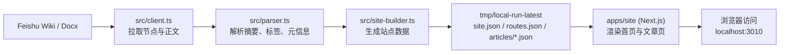

# Feishu Wiki Website

把飞书知识库内容，一键生成并预览成网站。

## 你会得到什么

- 飞书内容自动拉取（Wiki + Docx）
- 自动解析站点配置、导航、文章内容
- 自动生成网站数据文件（`site.json`、`routes.json`、`articles/*.json`）
- 本地网站预览（Next.js）

---

## 3 分钟快速开始

### 1) 安装依赖

```bash
npm install
cd apps/site && npm install && cd ../..
```

### 2) 配置环境变量

```bash
cp .env.example .env
```

编辑 `.env`，至少填写这 4 项：

```env
FEISHU_APP_ID=cli_xxx
FEISHU_APP_SECRET=xxx
FEISHU_WIKI_SPACE_ID=xxx
FEISHU_SITE_CONFIG_TOKEN=xxx
```

### 3) 一键启动

```bash
npm run dev
```

打开浏览器访问：`http://localhost:3010`

---

## 工作原理



一句话：先把飞书内容构建成标准 JSON，再由 Next.js 渲染成网站页面。

---

## 站点配置文档怎么写

`FEISHU_SITE_CONFIG_TOKEN` 对应的是一篇飞书文档，内容示例：

```txt
site_title: 我的知识网站
site_description: 用飞书搭建内容网站
base_url: http://localhost:3010
theme: default
home_token: xxxxxxxxx
nav_root_token: xxxxxxxxx
slug_mode: title-cn
```

说明：
- `home_token`：首页文档 token
- `nav_root_token`：用于生成导航和文章列表的根节点 token
- `slug_mode` 可选：
  - `title-cn`（默认，支持中文 slug）
  - `ascii`

---

## 常用命令

```bash
# 只拉取并生成内容数据
npm run content:build

# 只启动网站（读取已有内容文件）
npm run site:dev

# 一键：先生成内容，再启动网站
npm run dev
```

默认内容输出目录：`tmp/local-run-latest`

---

## 项目结构

```txt
.
├── src/                    # 内容引擎
│   ├── client.ts           # 飞书 API 客户端
│   ├── parser.ts           # 解析与校验
│   ├── site-builder.ts     # 站点数据构建与落盘
│   └── renderer/           # 通用渲染组件
├── scripts/
│   └── build-content.ts    # content:build 脚本入口
├── apps/site/              # Next.js 预览站点
└── tmp/local-run-latest/   # 生成的数据文件
```

---

## 生成结果说明

运行 `content:build` 后，会生成：

- `tmp/local-run-latest/site.json`
- `tmp/local-run-latest/routes.json`
- `tmp/local-run-latest/articles/*.json`

这些文件就是前端站点的内容来源。

---

## 常见问题

### Q1: 报错 `Missing required env`

说明 `.env` 中缺少必要变量。请检查：

- `FEISHU_APP_ID`
- `FEISHU_APP_SECRET`
- `FEISHU_WIKI_SPACE_ID`
- `FEISHU_SITE_CONFIG_TOKEN`

### Q2: 页面显示“文章不存在”

通常是内容文件未更新。先重新生成：

```bash
npm run content:build
```

然后重启前端服务。

### Q3: 访问不到 `localhost:3010`

可能端口被占用，或服务未启动成功。检查终端日志并重试：

```bash
npm run dev
```

---

## 开发说明（简版）

- 本仓库默认是“内容构建 + 本地预览”模式
- 目前不包含支付/账号/会员系统
- 适合先验证：飞书内容 -> 网站展示 -> SEO 结构

---

## 环境变量完整示例

见文件：`.env.example`
